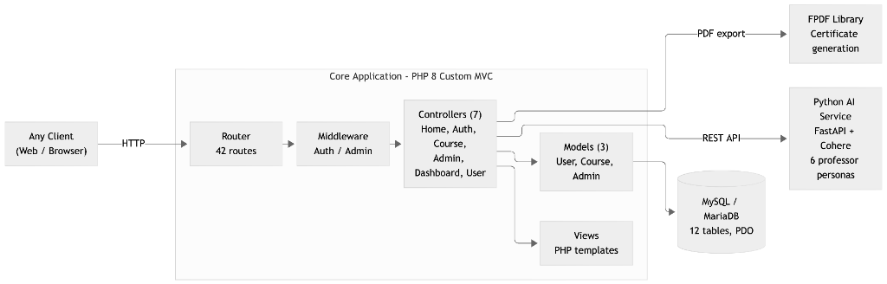

# Online Tutoring Service

A lightweight, secure, and custom-built PHP e-learning platform with an integrated Python AI microservice. This project demonstrates a robust MVC architecture implemented natively without relying on heavy frameworks like Laravel or Symfony, paired with a modern LLM-powered academic chat microservice.

## Overview
This platform is designed to provide core e-learning functionalities, including course management, user enrollment, and basic tracking, all underpinned by strict security practices, clean separation of concerns, and AI-assisted tutoring.

## Features
- **Custom MVC Architecture:** Native PHP implementation separating business logic from presentation.
- **Route-Level Middleware:** Secure route protection for both authenticated users and admin areas.
- **CSRF Protection:** Custom token generation and validation for all state-changing requests.
- **Environment Management:** Configuration through `.env` files for secure credentials handling.
- **Global Error Handling:** Intercepts and logs exceptions to avoid exposing stack traces to end users.
- **Admin Dashboard:** Centralized management for courses, user statistics, and system overview.
- **AI Professor Chat Microservice:** Integrated FastAPI service (`services/ai_service`) providing interactive multi-persona academic discussions powered by Cohere's language models.

## Tech Stack
- **Main Web Application:**
  - PHP 8.0+
  - MySQL / MariaDB (PDO)
  - HTML5, CSS3, JavaScript, Bootstrap 5.3
- **AI Microservice (`services/ai_service`):**
  - Python 3.9+
  - FastAPI & Uvicorn
  - Cohere API (`command-r-plus`)

## Getting Started

### Prerequisites
- PHP 8.0 or higher
- MySQL database
- Python 3.9+ (if running the AI service locally)
- A local server (Apache/Nginx/MAMP)

### Installation

1. **Clone the repository**
   ```bash
   git clone https://github.com/kaangulerr/online-tutoring-service.git
   cd online-tutoring-service
   ```

2. **Configure Environment**
   ```bash
   cp .env.example .env
   ```
   Edit `.env` and enter your database credentials (and optionally `AI_CHAT_API_URL` if connecting to the AI microservice).

3. **Database Setup**
   Import the schema and run the seeder to populate dummy data:
   ```bash
   mysql -u your_username -p your_database_name < database/schema.sql
   php database/seeder.php
   ```

4. **Run the Application**
   Using PHP's built-in server:
   ```bash
   php -S localhost:8000 -t public
   ```
   The application will be available at `http://localhost:8000`.

5. **Run the AI Microservice (Optional)**
   Detailed setup instructions are located in [`services/ai_service/README.md`](services/ai_service/README.md):
   ```bash
   cd services/ai_service
   pip install -r requirements.txt
   export COHERE_API_KEY=your_key_here
   uvicorn main:app --reload --port 8000
   ```

## Architecture



The client communicates over HTTP with a custom `Router` (42 routes), which passes requests through `Auth`/`Admin` middleware before dispatching to one of 7 controllers (`Home`, `Auth`, `Course`, `Admin`, `Dashboard`, `User`). Controllers coordinate 3 models (`User`, `Course`, `Admin`) backed by a MySQL/MariaDB database (12 tables via PDO), render PHP template views, generate PDF certificates via the FPDF library, and call out to the standalone Python AI microservice (FastAPI + Cohere, 6 professor personas) over a REST API.

## Architecture Highlights
- **Monorepo Structure:** Houses both the core PHP application and the companion Python AI microservice under `services/ai_service/`.
- **Routing:** A custom `Router` parses URIs, extracts dynamic parameters, and executes a defined middleware chain before dispatching to the Controller.
- **Database Layer:** A `Database` singleton ensures a single active PDO connection is reused efficiently.
- **Security:** All SQL queries use prepared statements. Sessions are secured with `httponly` and strict mode.

## Awards & Recognition

- **Beykoz University — Engineering Projects of the Year 2025 (*Yılın Mühendislik Projeleri 2025*)**
  - **Recognition:** *Online Tutoring Service* was awarded at the Beykoz University Engineering Projects of the Year 2025 showcase, developed over an intensive 5-month engineering effort.
  - **Read more:** [LinkedIn Post](https://www.linkedin.com/posts/kaangulerr_beykoz-%C3%BCniversitesi-y%C4%B1l%C4%B1n-m%C3%BChendislik-projeleri-activity-7342293735222751232-Uqrh)

## License

This project is licensed under the MIT License - see the [LICENSE](LICENSE) file for details.
